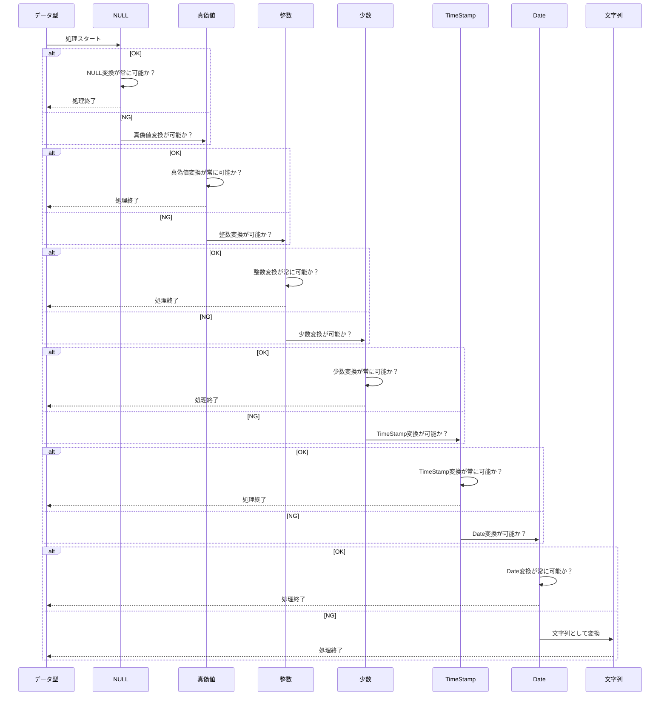

## 🎁 概要  
Kagerowは、CSV/TSVなどのファイルデータを一時的なデータベース（KDB）へ取り込み、SQL（KSQL）を使って検索・加工・変換できるデータ処理ツールです。<br/>
複数のCSVを結合したり、条件に応じてデータを抽出したり、SQL実行結果をCSV・JSON・Excelなどへ出力したりできます。<br/>
GUIによる操作に加えて、KSQLファイルを利用した処理の自動化や、CLIからの実行にも対応しています。

### こんなときに

Kagerowは次のような用途に利用できます。

- 複数のCSV/TSVをSQLで結合したい
- 大量のCSVから必要なデータだけ抽出したい
- CSVをSQLで集計・加工したい
- SQLの実行結果をCSVやJSONへ出力したい
- 定型的なCSV処理をスクリプト化したい
- GUIでSQLを確認しながらデータを処理したい
- CLIからKSQLを実行したい
- JavaからKagerowの機能を利用したい
- 独自のデータ入出力処理をプラグインとして追加したい

### 処理フローイメージ

```
          CSV / TSV
              │
              ▼
        Input Plugin
              │
              ▼
        ┌──────────┐
        │    KDB   │
        └──────────┘
              │
              ▼
            KSQL
              │
       ┌──────┴──────┐
       ▼             ▼
 Output Plugin     Command
       │             │
       ▼             ▼
 CSV / JSON /     外部コマンド
 Excel / HTML ...
```

## 🚀 特徴  
- **スクリプト**：専用形式のスクリプトファイルで複雑な処理が可能
- **プラグイン**：JavaのSPIを経由して自作のカスタムプラグインを追加することが可能
- **GUIアプリケーション**：Kagerowスクリプトの作成・編集・実行・管理を専用GUIから行えます
- **CLIアプリケーション**：Kagerowスクリプトの管理・実行を専用CLIから行えます
- **ライブラリ**：Java標準のアーカイブ形式で提供されるため、Javaライブラリとして利用できます

## 🛠️ 使用技術  
- **言語**：JavaSE 25 (OpenJDK)
- **ビルドツール**：Maven
- **IDE**：VSCode
- **その他**：JDBC(H2)

## 🔧 インストール  
**インストール**は任意のパスでダウンロードファイルを解凍するだけです。

### 💿 ダウンロード 

<table>
    <thead>
      <tr>
        <th>OS</th>
        <th>ダウンロードリンク</th>
        <th>配布形式</th>
      </tr>
    </thead>
    <tbody>
      <tr>
        <td rowspan=1">Windows</td>
        <td><a href="https://github.com/Keeeeeent/Kagerow/releases/latest/download/Kagerow-windous.zip">取得</a></td>
        <td>zip</td>
      </tr>
       <tr>
        <td rowspan="1">macOS</td>
        <td><a href="https://github.com/Keeeeeent/Kagerow/releases/latest/download/Kagerow-macos.tar.gz">取得</a></td>
        <td>tar</td>
      </tr>
      <tr>
        <td rowspan="1">Linux</td>
        <td>-</td>
        <td>tar</td>
      </tr>
      <tr>
        <td>LibraryOnly</td>
         <td><a href="https://github.com/Keeeeeent/Kagerow/releases/latest/download/application-core.jar">取得</a></td>
        <td>jar</td>
      </tr>
    </tbody>
</table>

## 対応環境・必要条件

### 対応環境

Kagerowは以下の環境を対象としています。

| OS      | GUI | CLI | RPC |
| ------- | --- | --- | --- |
| Windows | 対応  | 対応  | 対応  |
| macOS   | 対応  | 対応  | 対応  |
| Linux   | —   | —   | —   |

### 必要条件

Kagerowの配布パッケージには、実行に必要な **JREが同梱されています**。<br/>
そのため、配布パッケージを利用する場合、ユーザー自身でJavaをインストールする必要はありません。

#### 一般ユーザー

* 対応OS
* Kagerowの配布パッケージ

上記のみでKagerowを利用できます。

#### 開発者

Kagerowの開発には以下の環境が必要です。

* Java 25 / OpenJDK 25
* Maven
* Git

### Javaについて

KagerowはJava 25を使用して開発されています。<br/>
配布パッケージでは `jpackage` を使用してアプリケーションをパッケージ化し、実行に必要なJREを同梱しています。<br/>
そのため、システムにインストールされているJavaのバージョンに依存せず、Kagerowに同梱されたJavaランタイムを使用して実行します。


## 👀 使い方  
**Kagerow**の具体的な使い方について

### 用語
Kagerowでは、CSV/TSVなどのデータを取り込み、Kagerow内部で一時的に管理しながらSQLによる検索・加工を行います。<br/>
そのため、通常のデータベース製品とは異なるKagerow独自の用語が登場します。

| 用語    | 説明 |
| :-------- | :--------- |
| **KDB** | Kagerowがセッション中に管理する一時的なデータベースです。取り込んだCSV/TSVなどのデータをテーブルとして保持し、KSQLから検索・加工できます。通常はセッション終了時に削除されますが、キャッシュを有効にすることでデータを引き継ぐことができます。 |
| **KSQL** | Kagerowで実行するSQLを管理するためのスクリプト形式です。標準的なSQLをベースに、Kagerow独自の変数やテーブル世代管理などの機能を利用できます。KSQLファイルはXML形式で構成され、設定、環境変数、プラグイン、SQL、外部コマンドなどを一つのスクリプトとして管理できます。 |
| **KSQLファイル** | Kagerowが読み込んで実行するXML形式のスクリプトファイルです。`kagerow-script`をルート要素とし、`configuration`、`environment`、`plugins`、`ksqls`、`command`などのセクションで構成されます。 |
| **セッション** | Kagerowがデータを取り込み、KSQLを実行する一連の実行単位です。セッションごとにKDBが構築され、セッション終了時に通常の一時データは破棄されます。 |
| **プラグイン** | Kagerowの処理を拡張する仕組みです。CSV/TSVの入出力、JDBCによる外部DBからのデータ取得、JSONやExcelなどへの出力、DDL実行などを担当できます。JavaのSPIを利用して独自プラグインを追加することもできます。 |
| **Input Plugin** | KDBへデータを入力するためのプラグインです。CSV、TSV、JDBC、DDLなどを利用してKDBにデータを取り込む際に使用します。 |
| **Output Plugin** | KSQLの実行結果を外部へ出力するためのプラグインです。CSV、TSV、JSON、NDJSON、Excel、HTML、XMLなどの形式に対応できます。 |
| **Command** | KSQLの実行が完了した後に、OS上で外部コマンドを実行するための仕組みです。Windowsでは`cmd`やPowerShell、Unix系OSでは`sh`や`bash`などを利用できます。 |
| **スクリプト環境変数** | KSQLやCommandなどの実行時に利用できる環境変数です。プラットフォームの環境変数に加えて、Kagerowが管理する実行時情報やスクリプト固有の値を参照できます。 |
| **世代管理** | 同じヘッダーと同じデータ型を持つデータを同一形式として管理し、取り込まれたデータを世代として保持する仕組みです。KSQLから`${テーブル名[n]}`、`${テーブル名[L]}`などの形式で特定の世代を参照できます。 |
| **キャッシュ** | KDBのデータをセッション終了後も保持し、次回のKDB構築時に再利用するための機能です。大量のデータを扱う場合は、KDB構築時間の短縮にも利用できます。 |

### アプリケーションの起動
アプリケーションの起動は簡単です。</br>
アプリケーションアイコンをダブルクリック、または専用コマンドをプロンプトで入力することで起動できます。


### スクリプト作成

さて、初めてのスクリプトを作成してみましょう。</br>
まずは画面左上のファイルをクリックし、スクリプト追加ボタンをクリックしてください。


スクリプト追加ボタン押下後、新規スクリプトのタブが追加されます。


追加されたスクリプトをあなたの目的にあった名称と概要に変更しましょう。


最後に実行するSQLを追加します。</br>
画面上部のKSQLボタンを押下し、画面を切り替えてください。


画面の切り替えができたら追加ボタンをクリックし、実行するSQLを追加しましょう！


### スクリプト保存

スクリプトの保存は簡単です。</br>
画面左上のファイルメニューからスクリプト保存ボタンを押下するか、Ctrl+Sで行えます。


### データ取込

実際に使用する場合、単一もしくは複数のCSV/TSVを組み合わせてデータの検索や加工を行うと思います。</br>
そのためには事前にデータを取り込む必要があります。</br>

データ取込は以下仕様の通りになっているため、さまざまな場面で対応が可能です。

- 文字コードはJVM標準で対応しているものから選択可能
- ヘッダーの有無を選択可能（ヘッダーがない場合はKagerowが自動でヘッダーを付与）
- SQLで使用できないヘッダー名が存在する場合は、プレフィックスを付与
- 同じ形式のデータ（同じCSV/TSVのヘッダー）は、同じテーブルとして世代管理できます
- データの重複を防止できます
- 取込後のデータ型はKagerowが自動で選択。データ変換可能な範囲で、最も適した型が自動的に選択されます。
- セキュアデータを選択することで、セル単位の暗号化が可能です。※暗号化方式については後述します。

#### 主な対応文字コード

| 文字コード    | 対応状況 |
| :-------- | :--------- |
| UTF-8     | ✅       |
| UTF-16(BE/LE)     | ✅       |
| UTF-32(BE/LE)     | ✅       |
| Shift-JIS     | ✅       |
| Windows-31J     | ✅       |
| MS932(CP932)     | ✅       |
| EUC-JP     | ✅       |
| ISO-2022-JP     | ✅       |
| US-ASCII    | ✅       |
| ISO-8859-1     | ✅       |

#### 自動ヘッダー付与について

**Kagerow** ではヘッダーがないデータに対して以下命名規則で自動的にヘッダーを付与することが可能です。

- COLUMN_{n}形式（nは1から始まる数値）
- ヘッダーなしオプションを指定の場合、ファイル先頭からデータ取込
- ヘッダーありオプションを指定の場合はファイル先頭をヘッダーとして解釈

#### ヘッダーへのプレフィックス付与について

**Kagerow** ではヘッダーにSQL予約語が含まれている場合プレフィックスを付与します。</br>
プレフィックスはデフォルトで「K_」となっており、ヘッダーの先頭に付与されます。

例) IN → K_IN

#### データの世代管理について

**Kagerow** では「 *同じヘッダー* + *同じデータ型* 」のデータは同じ形式として解釈されます。</br>
同じデータとして取り込まれたデータは、0から始まる管理番号と共に世代管理されSQL内部で以下形式で参照することが可能です。

- ${テーブル名[n]}
- ${テーブル名[L]}
- ${テーブル名[Ln]}

※nは0から始まる番号</br>
※Lは世代数の最後の添字となります
※世代数が負数、もしくは管理している世代数以上の場合スクリプトの実行は失敗します

#### データの重複について

**Kagerow** では前項で説明をした「同じ形式」のデータでファイルのバイナリが一致した場合、データの重複と解釈します。</br>
データの重複が発生した場合、Kagerowは既に管理下にあるためデータ取込を中断し中間バイナリをロールバックします。</br>
これは仕様で定めているため回避することはできません。</br>

#### 取込後のデータ型について

**Kagerow** では以下順序でデータ変換処理を行います。



#### 実際にデータを取り込んでみましょう

データの取り込みも非常に簡単です。</br>
画面左上のファイルをクリックし、データ取込ボタンをクリックしてください。


続けて取込対象のファイルを選択し、オプションを選択しましょう！


オプションが選択できたら実行ボタンを押下しデータを取り込みます。</br>

正常に取り込みができていればコンテキストが追加されているはずです。


### スクリプト編集

さて、ここからは、スクリプトの各種設定と内容について説明します。</br>
スクリプトには以下構成要素があります。

- 共通設定（Common）
- SQL設定（KSQL）
- プラグイン設定（Plugin）
- 外部コマンド設定（Command）

ここからは各構成要素について説明します。

#### 共通設定（Common）

**Kagerow** の共通設定では以下項目が設定可能です。

| 設定項目         | 説明 |
| :-------------- | :--------- |
| スクリプト名称     | スクリプトに付与できる固有の名称です |
| スクリプト概要     | スクリプトの概要を自由記述できます |
| 実行モード        | スクリプトの実行モードを選択します。モードは初回のみ変更できます。 |
| カレントスキーマ   | KSQL実行時のカレントスキーマを指定します。 |
| スクリプト環境変数 | スクリプト実行時に使用できる環境変数を指定できます。 |
| キャッシュ        | KDBをキャッシュします。 |


##### 選択可能な実行モード

**Kagerow** ではH2提供の以下互換モードを使用可能です。</br>
デフォルトではOracleです。

- H2
- Oracle
- MySql
- PostgreSQL

##### スクリプト環境変数について

**Kagerow** ではプラットフォームに設定された環境変数を暗黙的に宣言します。</br>
変数宣言の優先順位は以下の通りです。

1. プラットフォームで宣言された環境変数
2. Kagerow管理下の環境変数
3. 共通設定で宣言された環境変数

また**Kagerow** によって管理された環境変数が存在します。

| 変数名         | 説明 |
| :-------------- | :--------- |
| k_session_id     | スクリプト実行時のセッションIDです |
| k_tmp_dir     | Kagerow管理下の一時フォルダです |
| k_runtime_dir     | Kagerow管理下の実行時利用可能なフォルダです |
| k_script_name     | 共通設定にて指定したスクリプト名称です |
| k_script_exe_mode     | 共通設定にて指定したスクリプト実行モードです |
| k_schema     | 共通設定にて指定したカレントスキーマです |
| k_script_file_path     | スクリプトファイルパスです |
| k_timestamp     | スクリプトの実行日時です。この変数は`k_timestamp_format`にて指定されたフォーマットに従います |
| k_timestamp_format | `k_timestamp`の表示形式を指定します。デフォルトは`yyyyMMddHHmmSSS`です |

##### キャッシュについて

**Kagerow** では基本的にセッションが閉じると再度KDBを構築しなおします。</br>
データをKDB内部に保管したい場合はキャッシュ機能を使うことで、データを引き継ぐことが可能です。

また大容量データを取り扱う場合、キャッシュを行うことでKDB構築時間が短縮されるためパフォーマンス向上のヒントになるかもしれません。

#### SQL設定（KSQL）

**Kagerow** のSQL設定では以下項目が設定可能です。</br>
編集はテーブル左の編集ボタンを押下してください。

| 設定項目         | 説明 |
| :-------------- | :--------- |
| SQL             | SQLを記述します |
| 置換変数         | SQLで使用する変数宣言を行います |


##### 追加・削除

KSQLの追加・削除は、対象をテーブルから選択し、各種ボタンを押下して行います。

##### 個別実行

KSQLはKDB構築後であれば個別実行を行うことが可能です。</br>
個別実行は主にデバッグが開発工程で活躍します。

個別実行を行う際、キャッシュ機能を有効化していると個別実行前までのスナップショットを作成します。</br>
これはデバッグを行う際、無駄なキャッシュデータの蓄積を防止するためです。

#### プラグイン設定（Plugin）

**Kagerow** ではプラグインをスクリプト実行前後に実行することが可能です。</br>
基本的によく使用する機能に関しては`デフォルトプラグイン`として用意してありますが、</br>
必要に応じて、カスタムプラグインを作成・追加することもできます。


##### デフォルトプラグイン一覧

| プラグイン名称         | 説明 | I/O |
| :-------------- | :--------- | :--------- |
| KagerowCSVPlugin | CSV入出力を行います | I/O |
| KagerowTSVPlugin | TSV入出力を行います | I/O |
| KagerowDDLPlugin | DDL入力を行います | I |
| KagerowDTCPlugin | DUAL表を作成します | I |
| KagerowJDBCPlugin | JDBCを使用して外部DBからデータを入力します | I |
| KagerowJSONPlugin | 実行結果をJSON形式で出力します | O |
| KagerowNDJSONPlugin | 実行結果をNDJSON形式で出力します | O |
| KagerowTEXTPlugin | 実行結果をKey=Value形式で出力します | O |
| KagerowEXCELPlugin | 実行結果をExcelで出力します | O |
| KagerowHTMLPlugin | 実行結果をHTMLで出力します | O |
| KagerowXMLPlugin | 実行結果をWebRowSetXML形式で出力します | O |

##### プラグインパラメータ設定

プラグインにはパラメータ設定が必要となる場合があります。</br>
パラメータの設定は該当プラグインの編集ボタンを押下してください。


#### 外部コマンド設定（Command）

**Kagerow** ではスクリプトの最後に外部コマンドの実行が可能です。</br>

| 設定項目         | 説明 |
| :-------------- | :--------- |
| 実行モード       | コマンド実行環境を選択します |
| コマンド設定     | 実行するコマンドを指定します |
| 環境変数         | 実行時に必要な環境変数を指定します |

##### 実行モード一覧

選択可能な実行モードは、実行環境で利用可能なものだけが表示されます。

- cmd
- ps（PowerShell）
- sh
- bash


### スクリプト実行

スクリプトの実行は`スクリプト実行`ボタンを押下するか、Ctrl+Enterで可能です。</br>
実行が完了すると結果が表示されます。


### KSQLファイル
**Kagerow** は専用のXMLスキーマに沿って記述されるKSQLファイルを取り込み実行されます。</br>
ここからは、KSQLファイルの各セクションについて説明します。

#### ファイル構成
KSQLファイルは以下の主要構成要素によって管理されています。

```xml
<kagerow-script>
    <configuration>
        <name>...</name>
        <summary>...</summary>
        <mode>...</mode>
        <schema>...</schema>
        <cache>...</cache> <!-- 任意 -->
    </configuration>
    <environment> <!-- 任意 -->
        <env name="..." value="..." />
    </environment>
    <plugins> <!-- 任意 -->
        <input>
            <plugin
                id="..."
                name="..."
                package="..."
                next="...">
                <param name="...">...</param>
            </plugin>
        </input>
        <output>
            <plugin ... />
        </output>
    </plugins>
    <ksqls>
        <ksql
            id="..."
            name="..."
            next="...">
            <variable-declaration>
                <variable
                    name="..."
                    value="..." />
            </variable-declaration>
            <sql><![CDATA[
                SELECT ...
            ]]></sql>
        </ksql>
    </ksqls>
    <command>
        <environmental-variables>
            <variable
                name="..."
                value="..." />
        </environmental-variables>
        <cmd mode="bash">
            ...
        </cmd>
    </command>
</kagerow-script>
```

---

##### ルート要素
| 要素 | 必須 | 説明 |
|------|:---:|------|
| `configuration` | ✅ | スクリプトの基本設定 |
| `environment` | | スクリプトで利用する環境変数 |
| `plugins` | | 入力・出力プラグインの定義 |
| `ksqls` | ✅ | 実行するSQLの定義 |
| `command` | | SQL実行後に実行するコマンド |

---

##### configuration

| 要素 | 必須 | 説明 |
|------|:---:|------|
| `name` | ✅ | スクリプト名 |
| `summary` | ✅ | スクリプトの説明 |
| `mode` | ✅ | 実行モード |
| `schema` | ✅ | スキーマバージョン |
| `cache` | | キャッシュ設定 |

---

##### environment

実行時に利用する環境変数を定義します。

```xml
<environment>
    <env name="DB_HOST" value="localhost"/>
    <env name="DB_PORT" value="5432"/>
</environment>
```

| 属性 | 必須 | 説明 |
|------|:---:|------|
| `name` | ✅ | 環境変数名 |
| `value` | ✅ | 環境変数の値 |

---

##### plugins

プラグインは **input** と **output** に分類されます。

```xml

<plugins>
    <input>
        <plugin id="csv" name="CSV Reader">
            <param name="path">employees.csv</param>
            <param name="encoding">UTF-8</param>
        </plugin>
    </input>
    <output>
        <plugin id="excel" name="Excel Writer"/>
    </output>
</plugins>

```

###### plugin

| 属性 | 必須 | 説明 |
|------|:---:|------|
| `id` | ✅ | プラグインID |
| `name` | ✅ | プラグイン名 |
| `package` | | プラグインのパッケージ名 |
| `next` | | 次に実行するプラグインID |

###### param

| 属性 | 必須 | 説明 |
|------|:---:|------|
| `name` | ✅ | パラメータ名 |

要素の値がパラメータの値になります。

---

##### ksqls

```xml
<ksqls>
    <ksql id="main" name="社員一覧">
        <variable-declaration>
            <variable
                name="table"
                value="EMPLOYEE"/>
        </variable-declaration>
        <sql><![CDATA[
            SELECT * FROM ${table};
        ]]></sql>
    </ksql>
</ksqls>
```

###### ksql

| 属性 | 必須 | 説明 |
|------|:---:|------|
| `id` | ✅ | SQLの識別子 |
| `name` | ✅ | SQLの表示名 |
| `next` | | 次に実行するSQLのID |

###### variable

| 属性 | 必須 | 説明 |
|------|:---:|------|
| `name` | ✅ | 変数名 |
| `value` | ✅ | 変数の値 |

---

##### command

`command` はすべてのSQL実行後に実行されます。

```xml
<command>
    <environmental-variables>
        <variable
            name="OUTPUT"
            value="./output"/>
    </environmental-variables>
    <cmd mode="bash">
        echo "$OUTPUT"
    </cmd>
</command>
```

###### スクリプト種別

| 値 | 説明 |
|----|------|
| `ps` | PowerShell |
| `cmd` | Windows コマンドプロンプト |
| `sh` | POSIX Shell |
| `bash` | Bash |

###### environmental-variables

| 属性 | 必須 | 説明 |
|------|:---:|------|
| `name` | ✅ | 環境変数名 |
| `value` | ✅ | 環境変数の値 |

---

##### 最小構成サンプルスクリプト

以下はKagerowでSQLを実行する最小構成の例です。

```xml
<kagerow-script>
    <configuration>
        <name>sample</name>
        <summary>サンプルスクリプト</summary>
        <mode>Oracle</mode>
        <schema>sample</schema>
    </configuration>

    <ksqls>
        <ksql id="main" name="sample">
            <sql>SELECT * FROM DUAL</sql>
        </ksql>
    </ksqls>
</kagerow-script>
```

##### サンプルスクリプト

```xml
<?xml version="1.0" encoding="UTF-8" standalone="no"?>
<kagerow-script xmlns:xsi="http://www.w3.org/2001/XMLSchema-instance" xsi:noNamespaceSchemaLocation="KsqlSchema.xsd">
    <configuration>
        <name>練習スクリプト</name>
        <summary>サンプルデータを使用しスクリプトの練習を行うことを目的としています</summary>
        <mode>Oracle</mode>
        <schema>t_sample</schema>
        <cache>default</cache>
    </configuration>
    <environment>
        <env name="CONST_VALUE" value="L0"/>
    </environment>
    <plugins>
        <input>
            <plugin id="zhGdm" name="KagerowDDLPlugin" package="default/1/0/0">
                <param name="DDL"/>
            </plugin>
        </input>
        <output>
            <plugin id="czLMM" name="KagerowCSVPlugin" package="default/1/0/0">
                <param name="OutputPath">#{HOME}/sample.csv</param>
                <param name="DateFormat">YYYY-MM-dd</param>
                <param name="IsEscape">false</param>
                <param name="Charset">UTF-8</param>
                <param name="KsqlId">fKPgo</param>
                <param name="IsHeader">false</param>
            </plugin>
        </output>
    </plugins>
    <ksqls>
        <ksql id="fKPgo" name="sample" next="fPODz">
            <sql>SELECT * FROM ${test_table[#{CONST_VALUE}]}</sql>
        </ksql>
        <ksql id="fPODz" name="sample2">
            <variable-declaration>
                <variable name="SQL_PARAM" value="'KAGEROW'"/>
            </variable-declaration>
            <sql>SELECT * FROM VALUES((@{SQL_PARAM})) AS K_HLPER(DEF)</sql>
        </ksql>
    </ksqls>
    <command>
        <environmental-variables>
            <variable name="TEST_ENV" value="テスト"/>
        </environmental-variables>
        <cmd mode="sh">echo $TEST_ENV</cmd>
    </command>
</kagerow-script>
```

## ☕️ developer
開発者向けのページは[こちら](./public/design/index-README.md)です。

## ライセンス

Kagerowは **MIT License** のもとで公開しています。<br/>
Kagerow本体のソースコードは、MIT Licenseの条件に従って利用・改変・再配布できます。<br/>
また、Kagerowでは第三者ライブラリを使用しています。各ライブラリにはKagerowとは異なるライセンスが適用される場合があります。<br/>
第三者ライブラリのライセンスおよび著作権表示については、配布物に含まれる以下のファイルを確認してください。

* `LICENSE` — Kagerowのライセンス
* `THIRD-PARTY-NOTICES.txt` — 使用している第三者ライブラリのライセンス・著作権表示
* `licenses/` — 第三者ライブラリのライセンス本文

### 主な第三者ライブラリ

| ライブラリ              | 用途             | ライセンス              |
| ------------------ | -------------- | ------------------ |
| H2 Database Engine | SQL実行・一時データベース | EPL 1.0 / MPL 2.0  |
| picocli 4.7.7      | CLI            | Apache License 2.0 |

第三者ライブラリのライセンス条件については、各ライブラリのライセンス本文および配布物に含まれる `THIRD-PARTY-NOTICES.txt` を優先してください。<br/>
詳しくは、リポジトリの [`LICENSE`](./LICENSE) および [`THIRD-PARTY-NOTICES.txt`](./THIRD-PARTY-NOTICES.txt) を参照してください。
