## 🎁 概要  
**Kagerow** は、CSV を SQL や Java で簡単に操作できるアプリケーションです。   
GUI/CLIアプリケーション、ライブラリなど幅広い範囲で使用可能となっています。

## 📖 目次  
- [特徴](#-特徴)  
- [使用技術](#-使用技術)  
- [インストール](#-インストール)  
- [使い方](#-使い方)  
  - アプリケーションの起動
  - スクリプト作成
  - スクリプト保存
  - データ取込
    - 主な対応文字コード
    - 自動ヘッダー付与について
    - ヘッダーへのプレフィックス付与について
    - データの世代管理について
    - データの重複について
    - 取込後のデータ型について
    - 実際にデータを取り込んでみましょう
  - スクリプト編集
    - 共通設定（Common）
      - 選択可能な実行モード
      - スクリプト環境変数について
      - キャッシュについて
    - SQL設定（KSQL）
      - 追加・削除
      - 個別実行
    - プラグイン設定（Plugin）
      - デフォルトプラグイン一覧
      - プラグインパラメータ設定
    - 外部コマンド設定（Command）
      - 実行モード一覧
  - スクリプト実行
- [developer](#-developer)  

## 🚀 特徴  
- **スクリプト**：専用形式のスクリプトファイルで複雑な処理が可能
- **プラグイン**：JavaのSPIを経由して自作のカスタムプラグインを追加することが可能
- **GUIアプリケーション**：Kagerowスクリプトを作成・編集・実行・管理を専用GUIから実施
- **CLIアプリケーション**：Kagerowスクリプトを管理・実行を専用CLIから実施
- **ライブラリ**：Java標準のアーカイブ形式のためJavaライブラリとして使用可能

## 🛠️ 使用技術  
- **言語**：JavaSE 25 (OpenJDK)
- **ビルドツール**：Maven
- **IDE**：Eclipse 2025
- **その他**：JDBC(H2)

## 🔧 インストール  
**インストール**は任意のパスでダウンロードファイルを解凍するだけです。

### 💿 ダウンロード 

<table>
    <thead>
      <tr>
        <th>OS</th>
        <th>ダウンロードリンク</th>
        <th>パッケージング</th>
        <th>容量 (MB)</th>
      </tr>
    </thead>
    <tbody>
      <tr>
        <td rowspan=1">Windous</td>
        <td><a href="https://github.com/Keeeeeent/Kagerow/releases/download/v1.0.0-%CE%B1/Kagerow-windous.zip">取得</a></td>
        <td>zip</td>
        <td>68.3</td>
      </tr>
       <tr>
        <td rowspan="1">Mac OS</td>
        <td><a href="https://github.com/Keeeeeent/Kagerow/releases/download/v1.0.0-%CE%B1/Kagerow-macos.tar.gz">取得</a></td>
        <td>tar</td>
        <td>70.9</td>
      </tr>
      <tr>
        <td rowspan="1">Linux</td>
        <td>-</td>
        <td>tar</td>
        <td>-</td>
      </tr>
      <tr>
        <td>LibraryOnly</td>
         <td><a href="https://github.com/Keeeeeent/Kagerow/releases/download/v1.0.0-%CE%B1/application-core.jar">取得</a></td>
        <td>jar</td>
        <td>1</td>
      </tr>
    </tbody>
</table>

## 👀 使い方  
**Kagerow**の具体的な使い方について

### 用語

| 用語    | 説明 |
| :-------- | :--------- |
| KDB | Kagerow管理下の一時的なデータベースです。セッションクローズと共に削除されます。 |
| KSQL | 標準的なSQLをKagerow独自に拡張したスクリプト言語です。各セクションに分かれたXMLとして保存します。 |

### アプリケーションの起動

アプリケーションの起動は非常に簡単です。 
アプリケーションアイコンをダブルクリック、または専用コマンドをプロンプトで入力することで起動できます。

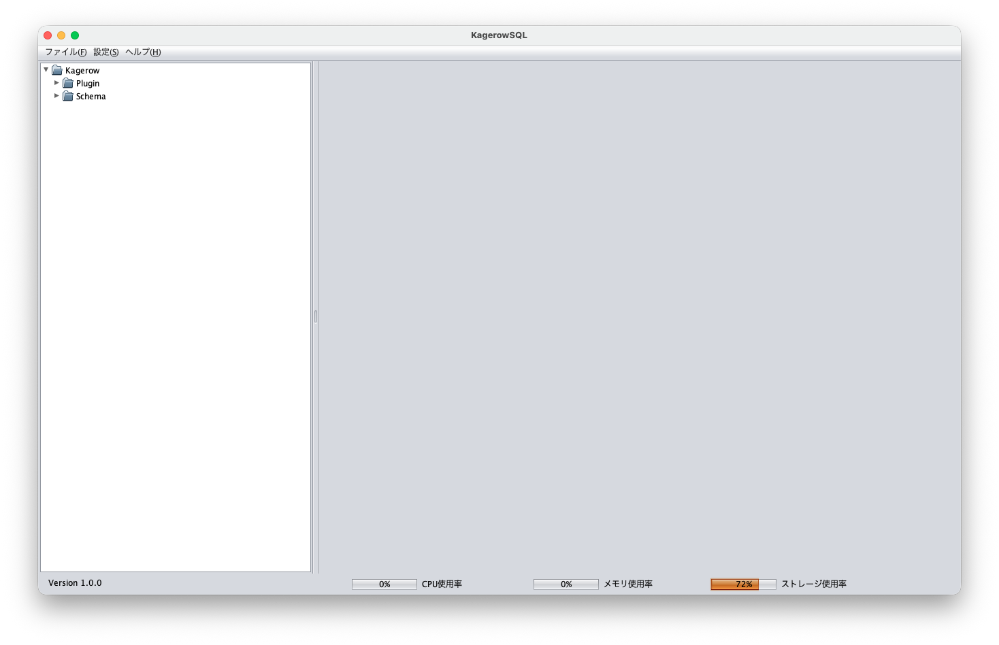

### スクリプト作成

さて、初めてのスクリプトを作成してみましょう。 
まずは画面左上のファイルをクリックし、スクリプト追加ボタンをクリックしてください。

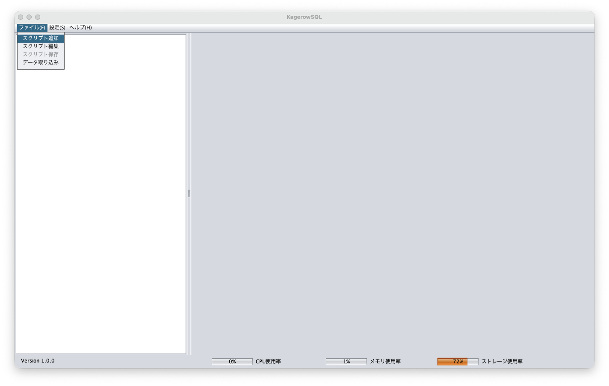

スクリプト追加ボタン押下後、新規スクリプトのタブが追加されます。

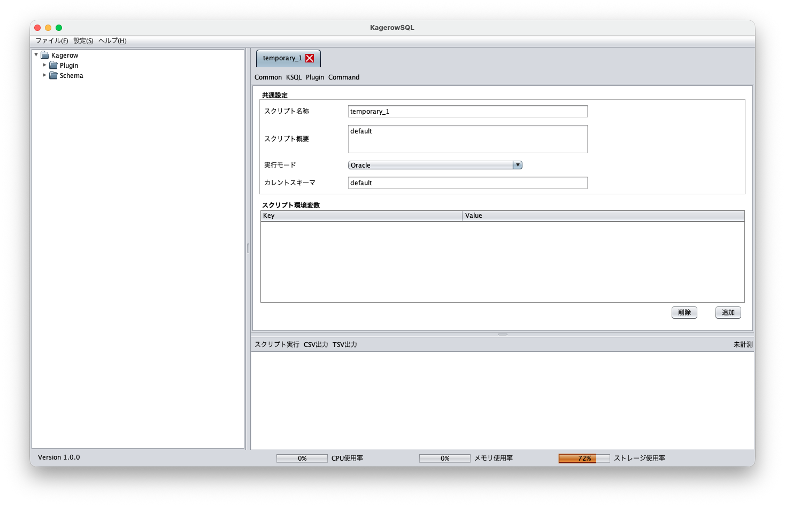

追加されたスクリプトをあなたの目的にあった名称と概要に変更しましょう。

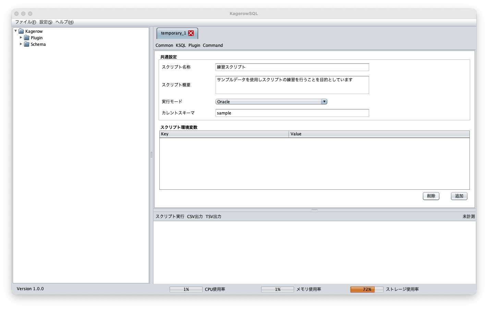

最後に実行するSQLを追加します。 
画面上部のKSQLボタンを押下し、画面を切り替えてください。

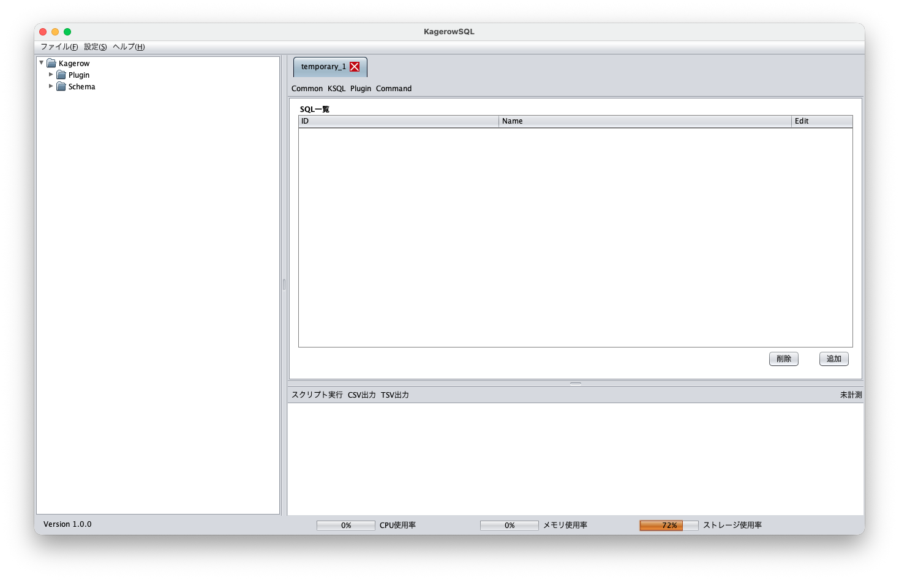

画面の切り替えができたら追加ボタンをクリックし、実行するSQLを追加しましょう！

### スクリプト保存

スクリプトの保存は簡単です。 
画面左上のファイルメニューからスクリプト保存ボタンを押下するか、Ctrl+Sで行えます。

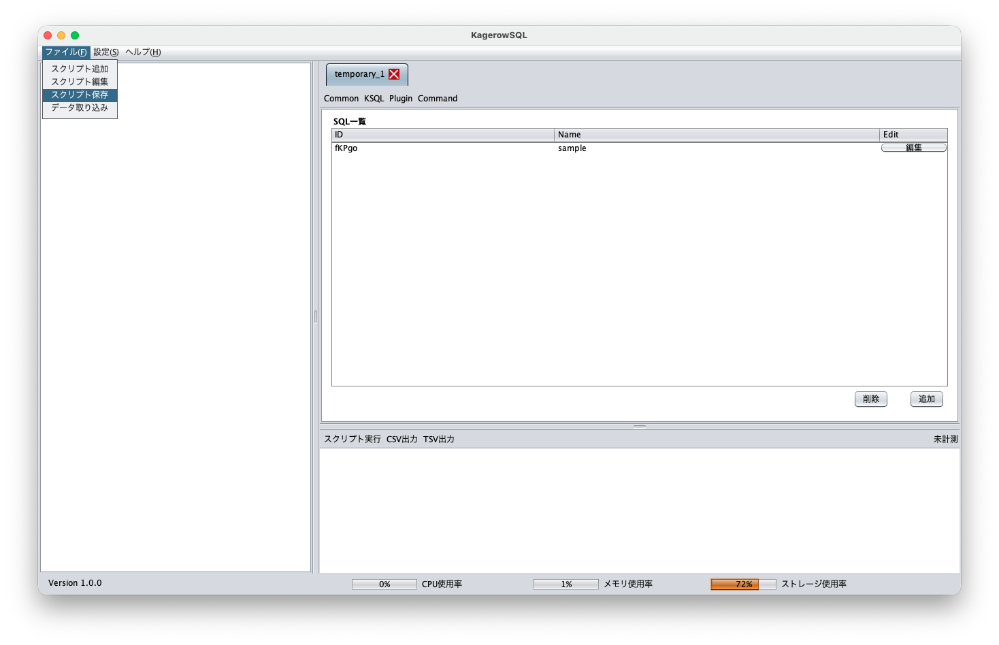

### データ取込

実際に使用する場合、単一もしくは複数のCSV/TSVを組み合わせてデータの検索や加工を行うと思います。 
そのためには事前にデータを取り込む必要があります。 

データ取込は以下仕様の通りになっているため、さまざまな場面で対応が可能です。

- 文字コードはJVM標準で対応しているものから選択可能
- ヘッダーの有無を選択可能（ヘッダーがない場合はKagerowが自動でヘッダーを付与）
- SQLで使用不可能なヘッダー名称が存在した場合、プレフィックスを付与
- 同じ形式のデータ（同じCSV/TSVのヘッダー）は同じテーブルとして世代管理が可能
- データ重複防止
- 取込後のデータ型はKagerowが自動で選択。選択はデータ変換可能な範囲で最も近しいものとなる。
- セキュアデータを選択することで、セル単位で暗号化が可能。※暗号化方式については後述

#### 主な対応文字コード

| 文字コード    | 対応状況 |
| :-------- | :--------- |
| UTF-8     | ✅       |
| UTF-16(BE/LE)     | ✅       |
| UTF-32(BE/LE)     | ✅       |
| Shift-JIS     | ✅       |
| Windous-31J     | ✅       |
| MS932(CP932)     | ✅       |
| EUC-JP     | ✅       |
| ISO-2022-JP     | ✅       |
| US-ASCII    | ✅       |
| ISO-8859-1     | ✅       |

#### 自動ヘッダー付与について

**Kagerow** ではヘッダーがないデータに対して以下命名規則で自動的にヘッダーを付与することが可能です。

- COLUMN_{n}形式（nは1から始まる数値）
- ヘッダーなしオプションを指定の場合、ファイル先頭からデータ取込
- ヘッダーありオプションを指定の場合はファイル先頭をヘッダーとして解釈

#### ヘッダーへのプレフィックス付与について

**Kagerow** ではヘッダーにSQL予約語が含まれている場合プレフィックスを付与します。 
プレフィックスはデフォルトで「K_」となっており、ヘッダーの先頭に付与されます。

例) IN → K_IN

#### データの世代管理について

**Kagerow** では「 *同じヘッダー* + *同じデータ型* 」のデータは同じ形式として解釈されます。 
同じデータとして取り込まれたデータは、0から始まる管理番号と共に世代管理されSQL内部で以下形式で参照することが可能です。

- ${テーブル名[n]}
- ${テーブル名[L]}
- ${テーブル名[n-L]}

※nは0から始まる番号 
※Lは世代数の最後の添字となります
※世代数が負数、もしくは管理している世代数以上の場合スクリプトの実行は失敗します

#### データの重複について

**Kagerow** では前項で説明をした「同じ形式」のデータでファイルのバイナリが一致した場合、データの重複と解釈します。 
データの重複が発生した場合、Kagerowは既に管理下にあるためデータ取込を中断し中間バイナリをロールバックします。 
これは仕様で定めているため回避することはできません。 

#### 取込後のデータ型について

**Kagerow** では以下順序でデータ変換処理を行います。

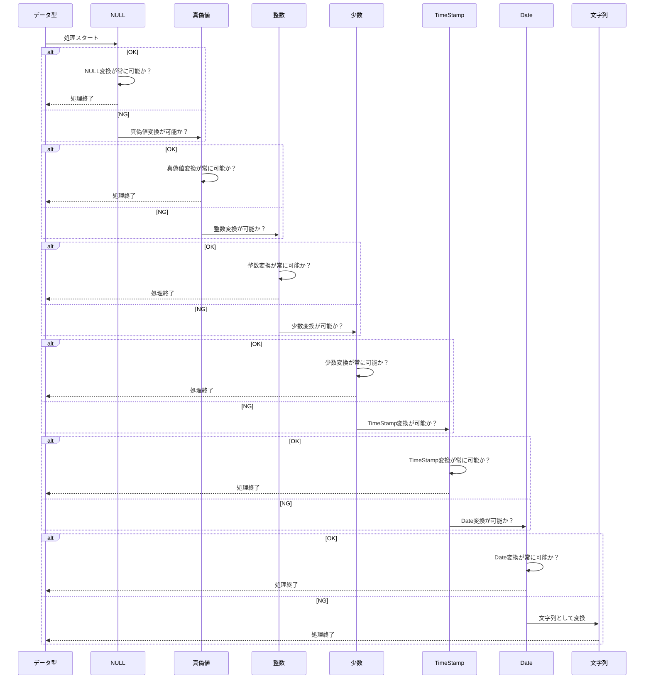
```mermaid

sequenceDiagram
  participant start as データ型
  participant line_1 as NULL
  participant line_2 as 真偽値
  participant line_3 as 整数
  participant line_4 as 少数
  participant line_5 as TimeStamp
  participant line_6 as Date
  participant line_7 as 文字列
  start ->> line_1: 処理スタート
  alt OK
    line_1 ->> line_1: NULL変換が常に可能か？
    line_1 -->> start : 処理終了
    else NG
    line_1 ->> line_2: 真偽値変換が可能か？
  end
  alt OK
    line_2 ->> line_2: 真偽値変換が常に可能か？
    line_2 -->> start : 処理終了
    else NG
    line_2 ->> line_3: 整数変換が可能か？
  end
  alt OK
    line_3 ->> line_3: 整数変換が常に可能か？
    line_3 -->> start : 処理終了
    else NG
    line_3 ->> line_4: 少数変換が可能か？
  end
  alt OK
    line_4 ->> line_4: 少数変換が常に可能か？
    line_4 -->> start : 処理終了
    else NG
    line_4 ->> line_5: TimeStamp変換が可能か？
  end
  alt OK
    line_5 ->> line_5: TimeStamp変換が常に可能か？
    line_5 -->> start : 処理終了
    else NG
    line_5 ->> line_6: Date変換が可能か？
  end
  alt OK
    line_6 ->> line_6: Date変換が常に可能か？
    line_6 -->> start : 処理終了
    else NG
    line_6 ->> line_7: 文字列として変換
    line_7 -->> start : 処理終了
  end
```

#### 実際にデータを取り込んでみましょう

データの取り込みも非常に簡単です。 
画面左上のファイルをクリックし、データ取込ボタンをクリックしてください。

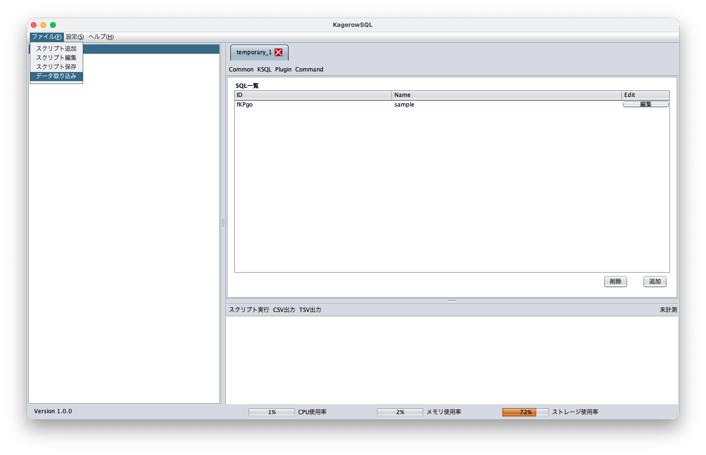

続けて取込対象のファイルを選択し、オプションを選択しましょう！

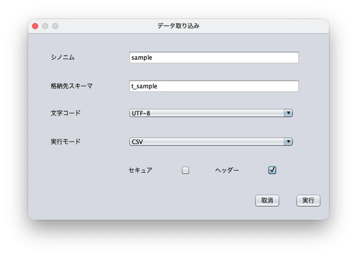

オプションが選択できたら実行ボタンを押下しデータを取り込みます。 
正常に取り込みができていればコンテキストが追加されているはずです。

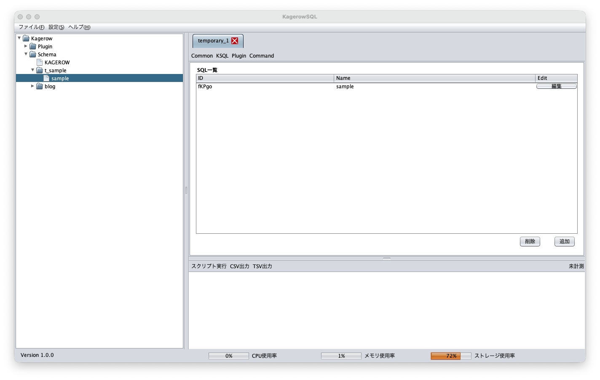

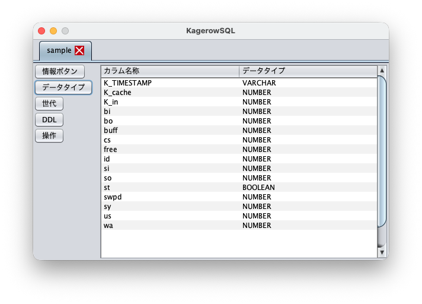

### スクリプト編集

さて、ここからはスクリプトの各種設定や内容について編集をしながら説明します。 
スクリプには以下構成要素があります。

- 共通設定（Common）
- SQL設定（KSQL）
- プラグイン設定（Plugin）
- 外部コマンド設定（Command）

ここからは各構成要素について説明します。

#### 共通設定（Common）

**Kagerow** の共通設定では以下項目が設定可能です。

| 設定項目         | 説明 |
| :-------------- | :--------- |
| スクリプト名称     | スクリプトに付与できる固有の名称です |
| スクリプト概要     | スクリプトの概要を自由記述できます |
| 実行モード        | スクリプトの実行モードを選択できます。モードの選択は初回のみ変更可能です。 |
| カレントスキーマ   | KSQLを実行する際のカレントスキーマを指定します。 |
| スクリプト環境変数 | スクリプト実行時に使用できる環境変数を指定できます。 |
| キャッシュ        | KDBをキャッシュします。 |

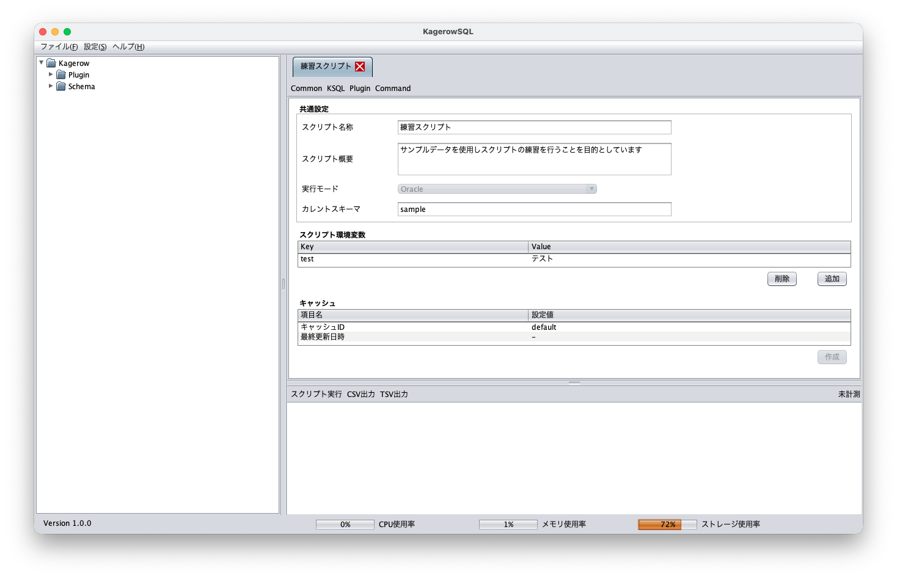

##### 選択可能な実行モード

**Kagerow** ではH2提供の以下互換モードを使用可能です。 
デフォルトではOracleです。

- H2
- Oracle
- MySql
- PostgreSQL

##### スクリプト環境変数について

**Kagerow** ではプラットフォームに設定された環境変数を暗黙的に宣言します。 
変数宣言の優先順位は以下の通りです。

1. プラットフォームで宣言された環境変数
2. Kagerow管理下の環境変数
3. 共通設定で宣言された環境変数

また**Kagerow** によって管理された環境変数が存在ます。

| 変数名         | 説明 |
| :-------------- | :--------- |
| k_session_id     | スクリプト実行時のセッションIDです |
| k_tmp_dir     | Kagerow管理下の一時フォルダです |
| k_runtime_dir     | Kagerow管理下の実行時利用可能なフォルダです |
| k_script_name     | 共通設定にて指定したスクリプト名称です |
| k_script_exe_mode     | 共通設定にて指定したスクリプト実行モードです |
| k_schema     | 共通設定にて指定したカレントスキーマです |
| k_script_file_path     | スクリプトファイルパスです |
| k_timestamp     | 実行日時です。この変数は`k_timestamp_format`にて指定されたフォーマットに従います |
| k_timestamp_format | `k_timestamp`の表示形式を指定します。デフォルトは`yyyyMMddHHmmSSS`です |

##### キャッシュについて

**Kagerow** では基本的にセッションが閉じると再度KDBを構築しなおします。 
データをKDB内部に保管したい場合はキャッシュ機能を使うことで、データを引き継ぐことが可能です。

また大容量データを取り扱う場合、キャッシュを行うことでKDB構築時間が短縮されるためパフォーマンス向上のヒントになるかもしれません。

#### SQL設定（KSQL）

**Kagerow** のSQL設定では以下項目が設定可能です。 
編集はテーブル左の編集ボタンを押下してください。

| 設定項目         | 説明 |
| :-------------- | :--------- |
| SQL             | SQLを記述します |
| 置換変数         | SQLで使用する変数宣言を行います |

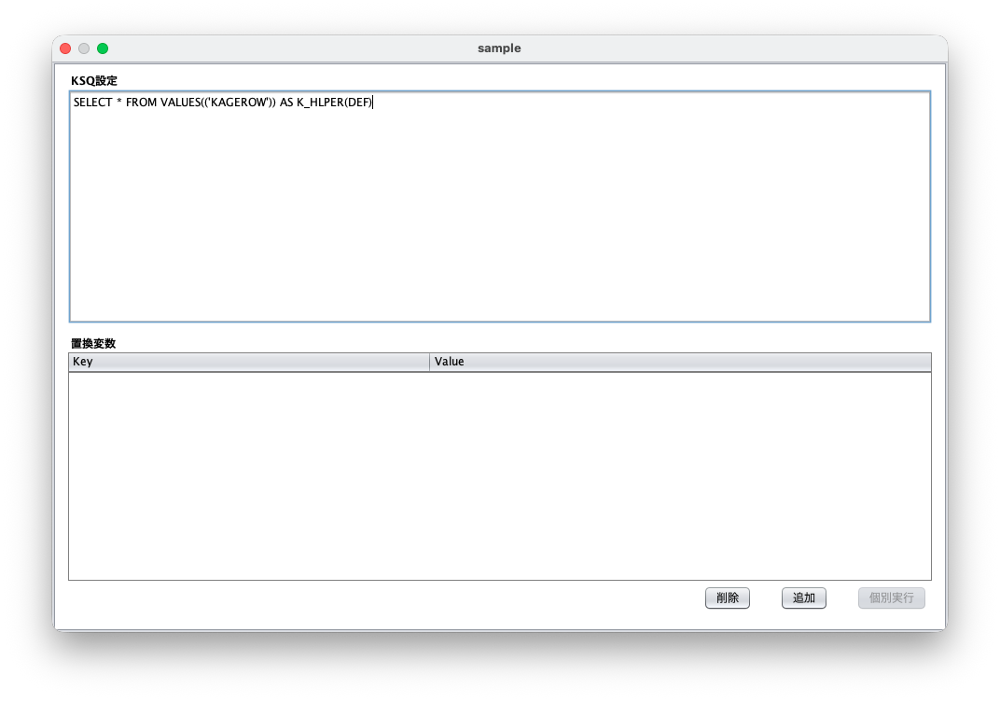

##### 追加・削除

KSQLの追加・削除は対象をテーブルから選択し、各種ボタンを押下してください。

##### 個別実行

KSQLはKDB構築後であれば個別実行を行うことが可能です。 
個別実行は主にデバックが開発工程で活躍します。

個別実行を行う際、キャッシュ機能を有効化していると個別実行前までのスナップショットを作成します。 
これはデバックを行う際、無駄なキャッシュデータの蓄積を防止するためです。

#### プラグイン設定（Plugin）

**Kagerow** ではプラグインをスクリプト実行前後に実行することが可能です。 
基本的によく使用する機能に関しては`デフォルトプラグイン`として用意してありますが、 
必要に応じてカスタムプラグインをご自身で作成・追加することも可能です。

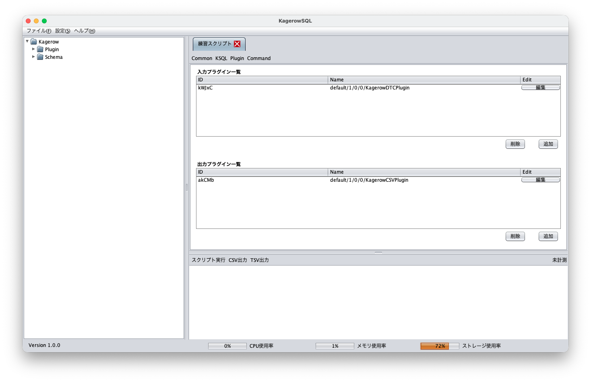

##### デフォルトプラグイン一覧

| プラグイン名称         | 説明 | I/O |
| :-------------- | :--------- | :--------- |
| KagerowCSVPlugin | CSV入出力を行います | I/O |
| KagerowTSVPlugin | TSV入出力を行います | I/O |
| KagerowDDLPlugin | DDL入力を行います | I |
| KagerowDTCPlugin | DUAL表を作成します | I |
| KagerowJDBCPlugin | JDBCを使用して外部DBからデータを入力します | I |
| KagerowJSONPlugin | 実行結果をJSON形式で出力します | O |
| KagerowNDJSONPlugin | 実行結果をNDJSON形式で出力します | O |
| KagerowTEXTPlugin | 実行結果をKey=Value形式で出力します | O |
| KagerowEXCELPlugin | 実行結果をExcelで出力します | O |
| KagerowHTMLPlugin | 実行結果をHTMLで出力します | O |
| KagerowXMLPlugin | 実行結果をWebRowSetXML形式で出力します | O |

##### プラグインパラメータ設定

プラグインにはパラメータ設定が必要となる場合があります。 
パラメータの設定は該当プラグインの編集ボタンを押下してください。

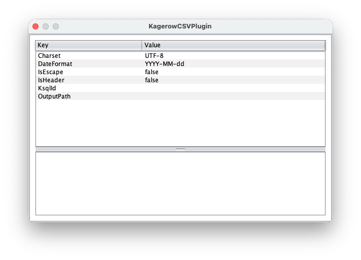

#### 外部コマンド設定（Command）

**Kagerow** ではスクリプトの最後に外部コマンドの実行が可能です。 

| 設定項目         | 説明 |
| :-------------- | :--------- |
| 実行モード       | コマンド実行環境を選択します |
| コマンド設定     | 実行するコマンドを指定します |
| 環境変数         | 実行時に必要な環境変数を指定します |

##### 実行モード一覧

選択可能な実行モードは各種プラットフォームで実際に使用可能なモードのみとなります。

- cmd
- ps（PowerShell）
- sh
- bash

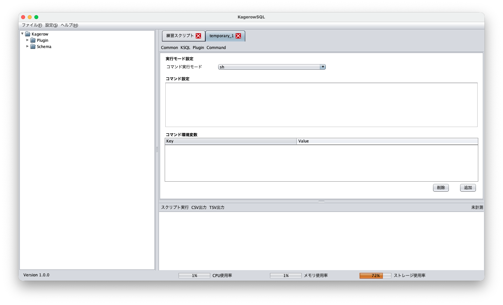

### スクリプト実行

スクリプトの実行は`スクリプト実行`ボタンを押下するか、Ctrl+Entryで可能です。 
実行が完了すると結果が表示されます。

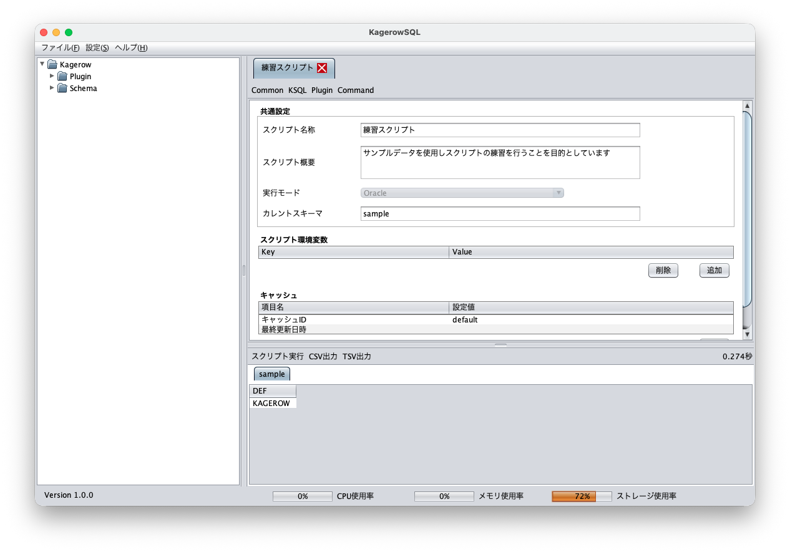

## ☕️ developer
開発者向けのページは[こちら](./public/design/index-README.md)です。
