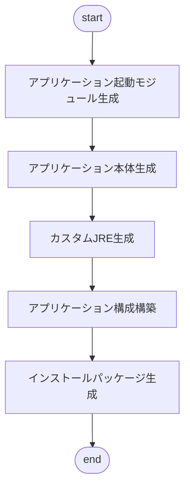

# Builderについて  

**Builder** は、アプリケーション構築するためのモジュールです

## 📖 目次  
- [機能](#-機能)  
- [使用技術](#-使用技術)  
- [ディレクトリ構成](#-ディレクトリ構成)  
- [初期化順序](#-初期化順序)  

## 🚀 機能  
- **アプリケーション起動モジュール生成** :アプリケーションを実行するためのランチャーの生成をします。生成はjarファイルまでです。
- **アプリケーション本体生成** :アプリケーション実行に必要なjarファイル生成、及びに依存関係の解決をします。生成はjarファイルまでです。
- **アプリケーション依存関係解析** :生成したランチャーと本体に必要な標準モジュールの解析を行い、次のフェーズに引き継ぎます。jdepsによる解析を行います。
- **カスタムJRE生成** :解析した結果を元に、最適な実行環境を構築します。jlinkによる構築を行います。
- **アプリケーション構成構築** :生成された資材をもとに、アプリケーション実行に必要な環境構築をします。tmpフォルダに構築。
- **インストールパッケージ生成** :アプリケーション実行環境と構築した環境をインストーラーにパッケージします。この時点で配布可能な状態です。

## 🛠️ 使用技術  
- **ProcessBuilder**：外部コマンド実行
- **Document**：xml解析
- **nio**：IO処理

## 🔧 ディレクトリ構成  
```shell
% tree -a -I ".git|.vscode|.DS_Store|target|.classpath|.project|.settings|*.properties" -L 8
├── pom.xml
└── src
    ├── dist
    ├── main
    │   ├── java
    │   │   ├── com
    │   │   │   └── sakulabo
    │   │   │       └── builder
    │   │   │           ├── Builder
    │   │   │           │   ├── AbstractCommandBuilder.java     # コマンド生成処理の実装を提供する基底クラス
    │   │   │           │   ├── Builder.java                    # ビルド処理の機能を提供する基底クラス
    │   │   │           │   ├── BuilderFactory.java             # ビルダーを生成するファクトリクラス
    │   │   │           │   ├── CommandBuilder.java             # コマンド生成処理を提供する規定インターフェイス
    │   │   │           │   └── Impl                            # コマンド生成処理を提供する実装クラス群
    │   │   │           └── Main.java
    │   │   └── module-info.java
    │   └── resources
    │       └── default-build.xml                               # ビルド実行構成ファイル（デフォルト）
    └── test
        ├── java
        └── resources
```

## 🚀 ビルド順序  

