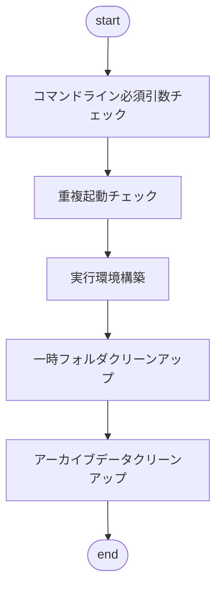

# Launcherについて  

**Launcher** は、アプリケーション動作サポートをするためのモジュールです

## 📖 目次  
- [機能](#-機能)  
- [使用技術](#-使用技術)  
- [ディレクトリ構成](#-ディレクトリ構成)  
- [初期化順序](#-初期化順序)  

## 🚀 機能  
- **事前初期化**：アプリケーションの安定動作に必要な状態にする為、事前に初期化を実行します  
- **VMアタッチ**：起動中のVMインスタンスへ必要に応じて接続し、必要なデータ交換処理をします

## 🛠️ 使用技術  
- **Swing**：GUIダイアログ、初期化進捗画面
- **Socket**：プロセス間通信、排他制御
- **JavaAgent**：初期化エントリ、アタッチエントリ

## 🔧 ディレクトリ構成  
```shell
% tree -a -I ".git|.vscode|.DS_Store|target|.classpath|.project|.settings|*.properties|*.png" -L 8
.
├── pom.xml
└── src
    ├── main
    │   ├── java
    │   │   ├── com
    │   │   │   └── sakulabo
    │   │   │       └── launcher
    │   │   │           ├── Initer
    │   │   │           │   ├── GraphicalIniter.java                # IniterのGUI拡張クラス
    │   │   │           │   ├── Impl                                # InitProcessorの実装クラス群
    │   │   │           │   ├── InitProcessFailedException.java     # 初期化処理共通例外クラス
    │   │   │           │   ├── InitProcessor.java                  # 初期化処理の実装を規定インターフェイス
    │   │   │           │   └── Initer.java                         # 初期化処理の機能を提供する基底クラス
    │   │   │           ├── Inject
    │   │   │           │   └── LoardDIBeans.java                   # DIコンテキスト初期化処理の機能を提供する基底クラス
    │   │   │           └── common
    │   │   │               └── LauncherPathCreater.java            # ユーティリティクラス群（パス生成）
    │   │   │           └── Main.java                               # アプリケーションエントリ
    │   │   └── module-info.java
    │   └── resources
    │       ├── image                                               # 画像ファイル群
    │       └── message                                             # メッセージファイル群
    └── test
        ├── java
        └── resources
```

## 🚀 初期化順序  

